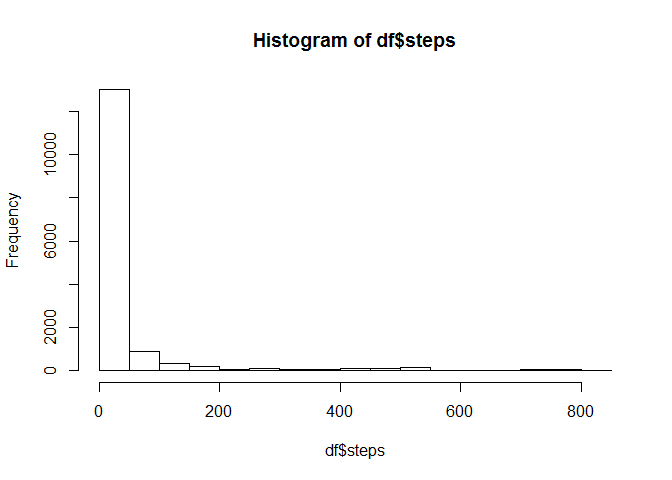
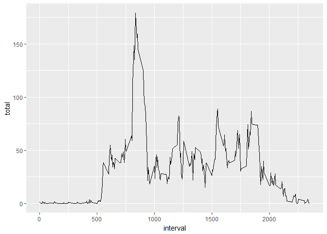
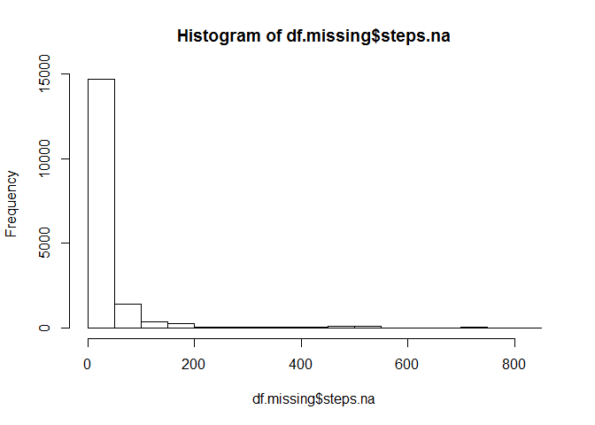
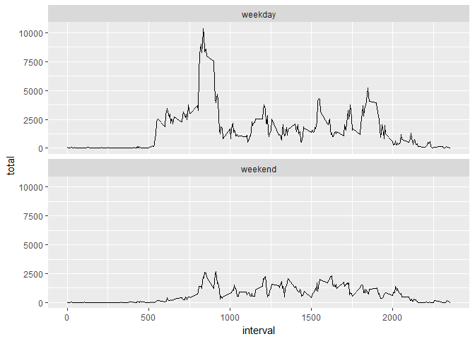

# Project 1
Ryan Morton  
## Loading and preprocessing the data


## What is mean total number of steps taken per day?


```r
hist(df$steps)
```

<!-- -->

The mean total number of steps is **37.3825996**.
The median total number of steps is **0**.

## What is the average daily activity pattern?


```r
df$steps[is.na(df$steps)] <- 0

df.ts <- df %>%
  group_by(interval) %>%
  summarize(total = mean(steps))

ggplot(df.ts, aes(x = interval, y = total, group = 1)) +
  geom_line()
```

<!-- -->

The interval with the largest average number of steps is **835**.

## Imputing missing values


```r
na.count <- df.missing %>%
  summarize_each(funs(sum(is.na(.))))
print(na.count) 
```

```
##   steps date interval
## 1  2304    0        0
```

```r
##replace NA with mean for that interval
df.missing <- df.missing %>%
  group_by(interval) %>%
  mutate(steps.na = ifelse(is.na(steps), mean(steps, na.rm =TRUE), steps))

hist(df.missing$steps.na)
```

<!-- -->

The mean total number of steps is **37.3825996**.
The median total number of steps is **0**.
It doesn't appear that imputing NAs with the mean changes the average steps but did increased the frequency counts as expected.

## Are there differences in activity patterns between weekdays and weekends?


```r
##create factor for weekday or weekend
df.missing$weekend <- as.factor(
  ifelse(weekdays(as.Date(df.missing$date, "%Y-%m-%d")) %in% c("Saturday", "Sunday"),"weekend","weekday"))

## create plot comparing steps on weekday versus weekend
df.week <- df.missing %>%
  group_by(weekend, interval) %>%
  summarise(total = sum(steps.na))

ggplot(df.week, aes(x = interval, y = total, group = 1)) +
  geom_line() +
  facet_wrap(~weekend, ncol = 1)
```

<!-- -->
